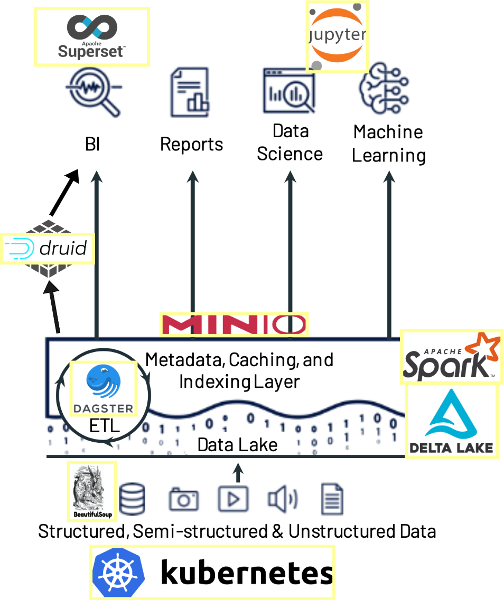

# Full Stack Data Engineering hands-on Project - Real Estate Data
## Project Outline
1. Collect real-estates data, using web scrapping tools like Scrapy or BeautifulSoup; Scraping from the Web -> save the properties info (city, state, location, price, status, owner) into zipped csv or json.e.g. [example scraper](https://github.com/oussafik/Web-Scraping-RealEstate-Beautifulsoup/blob/main/ScrapingToCsvFile.py)
2. Setup and save to S3. (use Amazon S3 or use S3 compatible S3-MinIO) [minIO](https://min.io/docs/minio/windows/index.html)
3. Accomplish Change Data Capture (CDC). Besides existing open-source CDC solutions like Debezium, can use own logic like pandasql, PySpark, etc.
4. Create delta lake table (dynamic Schema) and save to S3. With a Delta Lake table, we merge new changes with schema evolution. Delta Lake also provides merge, update and delete directly on your distributed files.
5. Ingests data from your input delta table (sitting on s3 bucket) into druid. The druid tabel will be used for what could impact housing price. You might want to consider other economic data such us like taxes, the population of city, schools, public transportation.
6. Orchestrating using Dagster: 

- Read cities from config.

- For each city (in parallel):

    - Scrape housing data.

    - Save city data as CSV.

    - Run CDC logic.

    - Upload new/changed records to S3; ingest time-series to Druid (run in parellel)

- After all cities are processed:

    - Read S3 for all updated data.

    - Merge into Delta Lake.

- Dockerize the application and run on kubenete cluster - deploy as a cron job

## Project Structure
- README.md: Project documentation and setup instructions.
- requirements.txt: List of Python dependencies.
- config/: Configuration files for S3, Dagster, and Druid.
- data/: Directory for storing raw and processed data files.
- scripts/: Python scripts for each major task.
    - scrape_real_estate.py: Script for web scraping real estate data using BeautifulSoup or Scrapy.
    - upload_to_s3.py: Script for uploading data to S3 or MinIO.
    - cdc_logic.py: Script implementing CDC logic using Pandas or PySpark.
    - create_delta_table.py: Script for creating and managing Delta Lake tables.
    - ingest_to_druid.py: Script for ingesting data into Druid.
- notebooks/: Jupyter notebooks for data exploration and analysis.
- dagster/: Directory for Dagster-specific components.
  - solids/: Directory containing Dagster solids for each task.
  - pipelines/: Directory containing Dagster pipeline definitions.

## Technical Details


### Delta Lake Technical Details

Delta Lake is an open-source storage layer that brings ACID transactions to Apache Spark and big data workloads. It provides reliable data lakes with features like schema enforcement, time travel, and more.

#### Key Features

- **ACID Transactions:** Delta Lake ensures data integrity with atomicity, consistency, isolation, and durability.
- **Schema Enforcement and Evolution:** Supports schema validation and allows schema changes over time.
- **Time Travel:** Enables querying of historical data by accessing previous versions of the data.
- **Unified Batch and Streaming:** Allows batch and streaming data processing in a single pipeline.
- **Scalable Metadata Handling:** Efficiently manages metadata for large-scale data lakes.
- **Data Versioning:** Keeps track of changes to data, enabling rollback and audit capabilities.

#### Architecture

Delta Lake is built on top of Apache Spark and leverages its distributed processing capabilities. It uses a combination of transaction logs and Parquet files to manage data and metadata.

- **Transaction Log:** A JSON-based log that records all changes to the data, ensuring ACID properties.
- **Parquet Files:** Stores the actual data in a columnar format, optimized for performance.

#### Use Cases

- **Data Lakes:** Provides a reliable and scalable storage solution for data lakes.
- **ETL Processes:** Simplifies extract, transform, and load operations with ACID guarantees.
- **Data Warehousing:** Supports complex queries and analytics with schema enforcement and time travel.

#### Reference Links

- [Delta Lake Documentation](https://docs.delta.io/latest/index.html)
- [Delta Lake GitHub Repository](https://github.com/delta-io/delta)
- [Delta Lake on Databricks](https://databricks.com/product/delta-lake)
- [Delta Lake Whitepaper](https://databricks.com/p/whitepapers/the-delta-lake-series-a-deep-dive)

#### Getting Started

To start using Delta Lake, you can integrate it with Apache Spark by configuring your Spark session:

```python
from pyspark.sql import SparkSession

spark = SparkSession.builder \
    .appName("DeltaLakeExample") \
    .config("spark.sql.extensions", "io.delta.sql.DeltaSparkSessionExtension") \
    .config("spark.sql.catalog.spark_catalog", "org.apache.spark.sql.delta.catalog.DeltaCatalog") \
    .getOrCreate()
```

### Dagster Technical Details

Dagster is an open-source data orchestrator for machine learning, analytics, and ETL. It provides a framework for building, managing, and monitoring data pipelines with a focus on data quality and observability.

#### Key Features

- **Data Pipelines:** Dagster allows you to define data pipelines as graphs of computations, called solids, which can be reused and composed.
- **Type System:** Supports a strong type system to ensure data quality and validate inputs and outputs.
- **Configurable Execution:** Provides flexible configuration options for pipeline execution, enabling parameterization and environment-specific settings.
- **Observability:** Offers built-in tools for monitoring and logging, including a web-based UI called Dagit for visualizing pipeline runs.
- **Dynamic Pipelines:** Supports dynamic pipelines that can change their structure based on runtime conditions.
- **Integration:** Easily integrates with popular data tools and platforms, such as Apache Spark, Pandas, and SQL databases.

#### Architecture

Dagster's architecture is centered around the concept of solids and pipelines:

- **Solids:** The basic unit of computation in Dagster, representing a single operation or task. Solids can be composed into larger workflows.
- **Pipelines:** A collection of solids connected by dependencies, forming a directed acyclic graph (DAG) that defines the execution order.
- **Dagit:** A web-based UI for visualizing and managing pipeline runs, providing insights into execution status and logs.
- **Schedulers and Sensors:** Tools for triggering pipeline runs based on time schedules or external events.

#### Use Cases

- **ETL Processes:** Automate extract, transform, and load operations with robust data quality checks.
- **Machine Learning Workflows:** Manage complex machine learning pipelines with reproducibility and observability.
- **Data Analytics:** Orchestrate data analytics workflows, ensuring data integrity and efficient execution.

#### Reference Links

- [Dagster Documentation](https://docs.dagster.io/)
- [Dagster GitHub Repository](https://github.com/dagster-io/dagster)
- [Dagster Blog](https://dagster.io/blog)
- [Dagster Community](https://dagster.io/community)

#### Getting Started

To start using Dagster, you can define a simple pipeline with solids:

```python
from dagster import solid, pipeline

@solid
def hello_world(context):
    context.log.info("Hello, world!")

@pipeline
def my_pipeline():
    hello_world()
```

### Apache Druid Technical Details

Apache Druid is a high-performance, real-time analytics database designed for fast aggregation and exploration of large datasets. It is particularly well-suited for time-series data and is often used for interactive analytics, business intelligence, and operational analytics.

#### Key Features

- **Real-time Data Ingestion:** Supports real-time data ingestion from streaming sources like Kafka and batch ingestion from files.
- **Fast Query Performance:** Optimized for low-latency queries, enabling interactive analytics with sub-second response times.
- **Scalability:** Designed to scale horizontally, allowing it to handle large datasets and high query loads.
- **Flexible Data Model:** Supports schema-on-read and schema-on-write, accommodating various types of data.
- **Time-based Partitioning:** Efficiently manages time-series data with time-based partitioning and indexing.
- **Integration with BI Tools:** Integrates with popular business intelligence tools for visualization and reporting.

#### Architecture

Druid's architecture consists of several key components:

- **Coordinator:** Manages data availability and replication, ensuring data is distributed across the cluster.
- **Overlord:** Handles task management and data ingestion, coordinating the ingestion process.
- **Broker:** Routes queries to the appropriate data nodes and aggregates results.
- **Historical:** Stores immutable data segments and serves queries on historical data.
- **MiddleManager:** Executes ingestion tasks and manages real-time data processing.
- **Deep Storage:** Stores data segments in a distributed storage system, such as HDFS or S3.

#### Use Cases

- **Real-time Analytics:** Provides real-time insights into streaming data, ideal for monitoring and operational analytics.
- **Business Intelligence:** Supports complex queries and aggregations for business intelligence applications.
- **Time-series Analysis:** Efficiently handles time-series data, making it suitable for IoT and telemetry data analysis.

#### Reference Links

- [Apache Druid Documentation](https://druid.apache.org/docs/latest/)
- [Apache Druid GitHub Repository](https://github.com/apache/druid)
- [Apache Druid Community](https://druid.apache.org/community/)
- [Apache Druid Blog](https://druid.apache.org/blog/)

#### Getting Started

To start using Apache Druid, you can set it up locally or deploy it on a cluster. Here's a basic setup using Docker:

```bash
# Pull the Druid Docker image
docker pull apache/druid:latest

# Run Druid using Docker
docker run -p 8888:8888 apache/druid:latest
```


